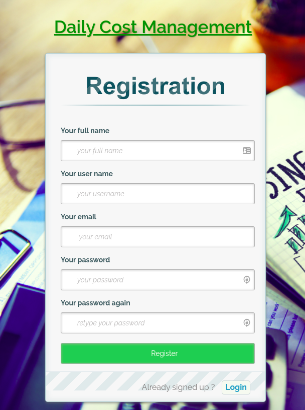
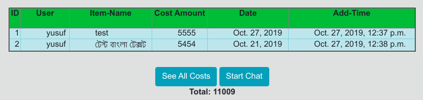
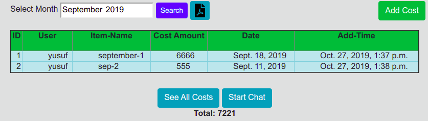
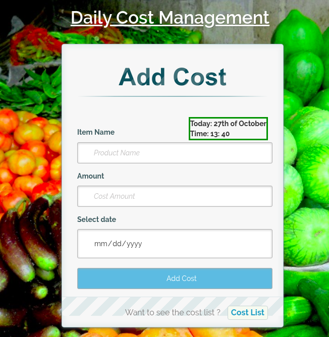
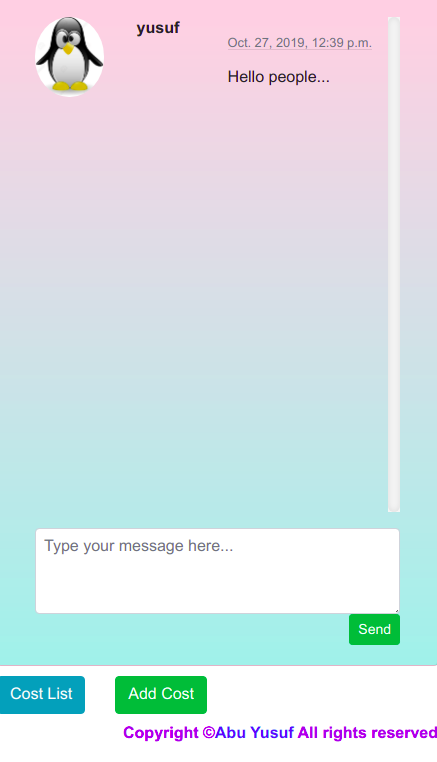

# my-cost-note
A daily cost management system using django: https://my-cost-note.herokuapp.com/

## Tools:
```
1.Django
2.Bootstrap-4
3.Postgres
4.JQuery
```


  
### After sucessfull login you are redirected to your current months cost list.
  
### You can search by months also here.
  
### You can restricted users to put cost entries.
  
  
### You can add your cost here like this.
  
### You can start a chat conversation with your partner(wife/cost-partner).

